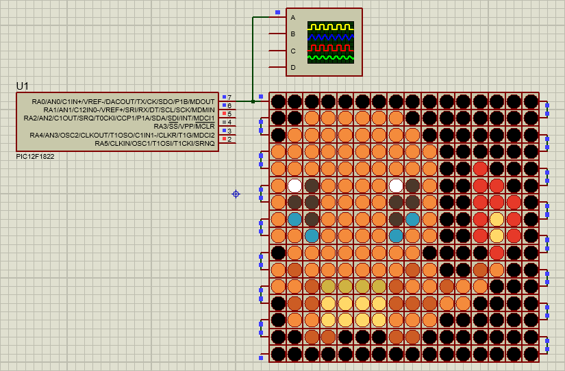

# NeoPixel Matrix Control with PIC Microcontroller

This project is part of a college subject and demonstrates how to control a 16x16 NeoPixel matrix using a PIC microcontroller to display a simple animation of Charmander. The code is written in MikroC Pro for PIC and is designed to work with a specific hardware setup.

The project's main difficulty was optimizing the code to ensure it met the time specifications required by the WS2812B NeoPixel datasheet.

## Screenshot

## Getting Started

To get started, simply download the repository and open the code in MikroC Pro. Follow the instructions in the code comments to modify the code or adjust the hardware setup as needed.

## Dependencies

- MikroC Pro for PIC v4.0 or later
- PIC12F1822 microcontroller
- NeoPixel matrix (16x16)

## License

This project is licensed under the [MIT License](LICENSE).
